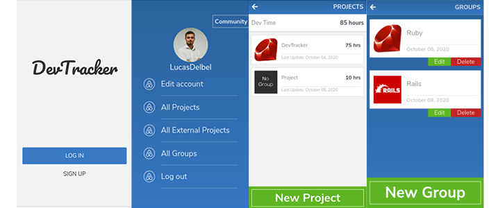

# Ruby on Rails Capstone Project - Group our Projects App

[]()
[]()
[]()

<br />
<p align="center">
  <a href="https://github.com/ldelbel/group-my-projects">
    
  </a>

  <h2 align="center">DevTracker App</h2>

  <h3 align="center">Capstone Project - Building an Service Mobile Web App with Grouping Functionality<h3>
  <p align="center">
    <a href="https://github.com/ldelbel/group-my-projects"><strong>Explore the docs »</strong></a>
    <br />
    <br />
    -
    <a href="https://github.com/ldelbel/group-my-projects/issues">Report Bug</a>
    -
    <a href="https://github.com/ldelbel/group-my-projects/pulls">Request Feature</a>
    -
  </p>
</p>
    
## Content

<p align="center">
  <a href="#about">About</a> •
  <a href="#ins">Installing</a> •
  <a href="#testing">Testing</a> •
  <a href="#with">Built With</a> •
  <a href="#tested">Tested With</a> •
  <a href="#author">Author</a>
</p>

## About this Project <a name = "about"></a>

This project is a requirement from Microverse for completing Ruby on Rails Curriculum. It is a web app for keeping track of hours dedicated in software development projects for developers, with Mobile-Only layout. 




## 🔧 Built with<a name = "with"></a>

- Ruby 2.7.1
- Rails 6.0.3.3
- Postgresql 10.14

## 🔧 Tested with<a name = "tested"></a>

- RSpec 3.9
- Capybara

## 🔨 Setup and Installing <a name = "ins"></a>

To prepare the Setup, run the following commands on terminal:

```
$ cd <folder> (to where you want to have the app)
$ git clone https://github.com/ldelbel/group-my-projects.git
$ cd group-my-projects
$ bundle install
$ yarn install --check-files (in case you don't have yearn installed)
```
Then configure postgresql, adding your username and password in database.yml:

```
at group-my-projects/config/database.yml

default: &default
  adapter: postgresql 
  pool: <%= ENV.fetch("RAILS_MAX_THREADS") { 5 } %>
  username: *****
  password: *****
```

## 🛠 Testing <a name = "testing"></a>

- run bundle exec rspec

## ✒️ Author <a name = "author"></a>

👤 **Lucas Delbel**

- Github: [@ldelbel](https://github.com/ldelbel)
- Twitter: [@delbel_lucas](https://twitter.com/delbel_lucas)
- Linkedin: [lucasdelbel](https://www.linkedin.com/in/lucasdelbel/)

## 🤝 Contributing

Contributions, issues and feature requests are welcome!

Feel free to check the [issues page]().

## 👍 Show your support

Give a ⭐️ if you like this project!

## :clap: Acknowledgements

- Microverse: [@microverse](https://www.microverse.org/)
- Design Idead by Gregoire Vella -  [Behance:Snapscan](https://www.behance.net/gallery/19759151/Snapscan-iOs-design-and-branding?tracking_source=)

